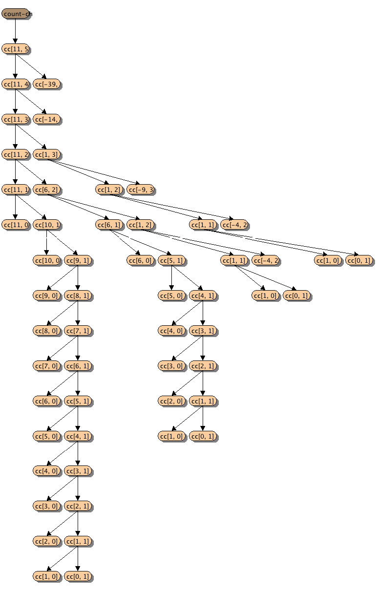

Draw the tree illustrating the process generated by the 
count-change procedure of section 1.2.2 in making change for 11 cents. 
What are the orders of growth of the space and number of steps used by this 
process as the amount to be changed increases?

```
(define (count-change amount)
  (cc amount 5))
(define (cc amount kinds-of-coins)
  (cond ((= amount 0) 1)
        ((or (< amount 0) (= kinds-of-coins 0)) 0)
        (else (+ (cc amount
                     (- kinds-of-coins 1))
                 (cc (- amount
                        (first-denomination kinds-of-coins))
                     kinds-of-coins)))))
(define (first-denomination kinds-of-coins)
  (cond ((= kinds-of-coins 1) 1)
        ((= kinds-of-coins 2) 5)
        ((= kinds-of-coins 3) 10)
        ((= kinds-of-coins 4) 25)
        ((= kinds-of-coins 5) 50)))
```

[](sicp-1.14.png)  

[PVTS]: http://www.davidpilo.com/pvts/index.html
_Graph is drawn by [PVTS][]_


**Order of space:**  
We can see that the deepest leaf is from cc(10, 1) node, the calculation is kept doing cc(k, 0) and cc(k - 1, 1).  The space required is actually the growing linearly as:

O(n)


**Number of steps:**  

We can see that the tree is actually containing many subtree cc(30, 1), cc(25, 1), cc(20, 1), etc.

Each cc(n, 1) requires 2n steps.
For each change amount, it requires n/k repeated subtree, where k is the kinds-of-coins in change.
The number of steps is (n/k) * 2n which is roughly:

O(n^2)
