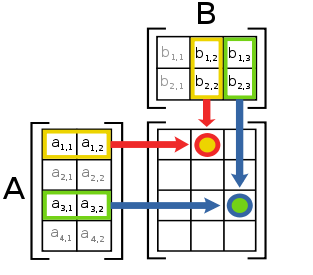

Suppose we represent vectors `v = (vᵢ)` as sequences of numbers, and matrices `m = (mᵢⱼ)` as sequences of vectors (the rows of the matrix). For example, the matrix

```
| 1 2 3 4 |
| 4 5 6 6 |
| 6 7 8 9 |
```

is represented as the sequence `((1 2 3 4) (4 5 6 6) (6 7 8 9))`. With this representation, we can use sequence operations to concisely express the basic matrix and vector operations. These operations (which are described in any book on matrix algebra) are the following:

```scheme
(dot-product v w)       returns the sum ∑ᵢvᵢwᵢ
(matrix-*-vector m v)   returns the vector t, where tᵢ = ∑ᵢmᵢⱼvⱼ
(matrix-*-matrix m n)   returns the matrix p, where pᵢⱼ = ∑ₖmᵢₖnₖⱼ
(transpose m)           returns the matrix n, where nᵢⱼ = mⱼᵢ
```

We can define the dot product as  

```scheme
(define (dot-product v w)
  (accumulate + 0 (map * v w)))
```

Fill in the missing expressions in the following procedures for computing the other matrix operations. (The procedure accumulate-n is defined in exercise 2.36.)

```scheme
(define (matrix-*-vector m v)
  (map <??> m))
(define (transpose mat)
  (accumulate-n <??> <??> mat))
(define (matrix-*-matrix m n)
  (let ((cols (transpose n)))
    (map <??> m)))
```

**Answer**
`dot-product` means: if `a = [a₁, a₂, ..., aₙ]` and `b = [b₁, b₂, ..., bₙ]`,
`a * b = a₁ * b₁ + a₂ * b₂ + ... + aₙ * bₙ`

```scheme
(define (accumulate op initial sequence)
  (if (null? sequence)
      initial
      (op (car sequence)
          (accumulate op initial (cdr sequence)))))
```

`matrix-*-vector` means:

```
| A B |   | Y |   | AY BZ |
| C D | * | Z | = | CY DZ |
| E F |           | EY FZ |
```

```scheme
(define (matrix-*-vector m v)
  (map (lambda (row) (accumulate cons '() (map * row v))) m))

; Verify
(define m '((1 2 3 4) (4 3 2 1)))
(define v '(4 3 2 1))
(matrix-*-vector m v)
```

`transpose` means:

```
| 1 2 |ᵀ = | 1 |
           | 2 |

| 1 2 |ᵀ   | 1 3 5 |
| 3 4 |  = | 2 4 6 |
| 5 6 |
```

```scheme
(define (transpose mat)
  (accumulate-n cons '() mat))

(define (accumulate-n op init seqs)
  (if (null? (car seqs))
      '()
      (cons (accumulate op init (accumulate (lambda (x y) (cons (car x) y)) '() seqs))
            (accumulate-n op init (accumulate (lambda (x y) (cons (cdr x) y)) '() seqs)))))

; Verify
(define x '((1 2)))
(define y '((1) (2)))
(transpose x)
(transpose y)

(define m '((1 2) (3 4) (5 6)))
(define n '((1 3 5) (2 4 6)))
(transpose m)
(transpose n)
```

`matrix-*-matrix` means:
When multiplying two matrices `m` and `n`, the resulting matrix will have the same number of rows as `m` and the same number of columns as `n`. Each element of the result matrix can be found by taking the dot product of each row of `m` and each column of `n`.

[](2.37.png)  

```
| A B |   | M N |   | AM + BO  AN + BP |
| C D | * | O P | = | CM + DO  CN + DP |
| E F |             | EM + FO  EN + FP |
```

```scheme
(define (matrix-*-matrix m n)
  (let ((cols (transpose n)))
    (map (lambda (x) (map (lambda(y) (dot-product y x)) cols)) m)))

(define m '((1 2) (3 4) (5 6)))
(define n '((1 3) (2 4)))

(matrix-*-matrix m n) ; ((5 11) (11 25) (17 39))
```
